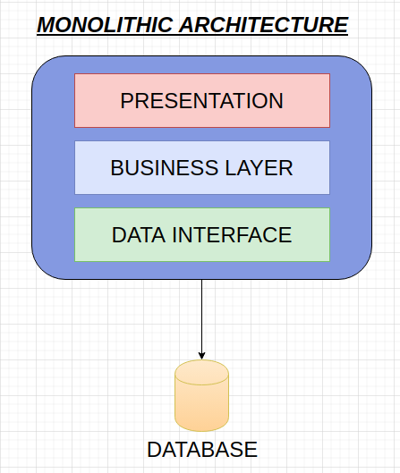
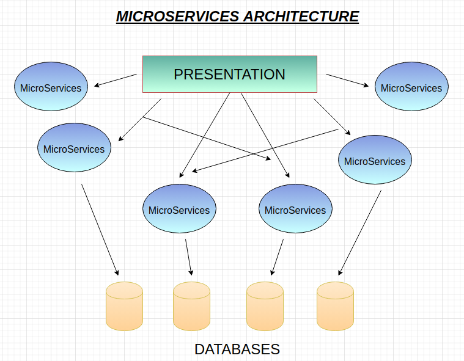

# What are MicroServices?

The evolution of technologies has changed the way of structuring our applications. To develop distributed, more scalable and highly maintainable and testable applications we need microservices. 

Microservices is a way of structuring an application as loosely coupled and highly cohesive services. It is a small component of application. Each service is maintained and developed individually to avoid complexity in application.To provide communication between services, a module provides a simple interface.

## Background

To early days of computer science, barriers to entry in programming language were high. Only PhD in computer can use these programming languages. In 1964, a general purpose lanugage **BASIC** was introduced.

BASIC lowers the barriers in programming. In 1960, there was a fast growth of software applications so software becomes large and complex. To tackle the complexity, **Divide and Conquer** technique was used.

In 1972, David Parnas introduced the concept of **Modularity** and **Information Hiding** which reduces complexity and make code reusability which reduces bugs in codes. 

#### Modularization

Decomposition of large, complex software system into **"Loosely Coupled, Highly Cohesive"** system which communicate via internal simple intrefaces. Here, we need to understand what is meant by Loosely Coupled and Highly Cohesive.

##### 1. Loosely Coupled

Dependency between modules should be very low

##### 2. Highly cohesive

One module should concentrate on single or comparable usefulness

In 1990s **Layered Application Architecture** was introduced to reduce the complexity of applications due to the rapid spread of internet. Then in 2000s, a **Cambrian Explosion** happens and then software starts eating the world. Then engineers found that Monolithic architecture cannot solve the innovative ideas and fast approach strategy. Then, Microservices were introduced.

## Monolithic Architecture

Monolithic Architecture are single service which holds all functionality of your application whether handling requests, database operations, communication within modules. Applications based on Monolithic Architecture are deployed as single App. Monoliths are layered architecture consists of many layers i.e. Presentation, Business and database.

### Pros 

1. Useful for small Team 
2. Simple to develop and test
3. Monolith Architecture is cheaper

### Cons

1. Lack of Innovation
2. tightly coupled system
3. Difficult to continuously Deploy
4. Not resilient, One bug can crash the whole application
5. Fixes bug
6. Time consuming

## Microservices Architecture

Microservices architecture is the most popular architecture for designing the application. Microservices architecture let you split down your large application into small , interconnected and independent systems. Each microservice works independently on individual and deployed independently. Thus, The software team understands the codebase easily, which increases productivity. Each service has its own database. Hence, simplify the development and deployment.

### Pros

1. Loosely Coupled 
2. Higlhly maintainable 
3. Deployed Independently
4. Appropriate Scaling
5. Resilient
6. Easy Codebase understanding

### Cons

1. Deploying an application is difficult
2. Testing becomes difficult
3. Communication between modules becomes hard
4. Management becomes complex due to distributed system

## Conclusion

As every technology has its pros and cons, so microservices has also its drawbacks. Microservices applications are complex to develop and better for large applications while monolithic are best for simple and lightweight applications. Microservices are faster to deploy and easier to understand. As a developer, It is important to know which architecture is best for your application. 
