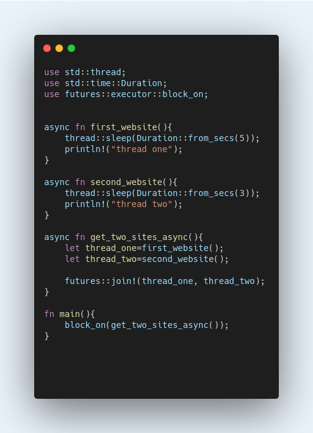

## Do you know about Asynchronous Rust ?

Rust is the most loving programming language by developers all around the world according to StackOverFlow survey. Rust is the growing language which remains for next 40 years. Rust is very new language. That's why Rust has not huge amount of developers.

Rust has roughly same binary as C and C++ language. But Rust guaranteed compile time with absence of undefined behavior. Moreover, Rust has other different features. The best one is Memory Safety feature. Python and Rust languages are both good in performance but rust guarantees you of memory safety. 


But, the most important reason why i like rust is due to its ownership feature and asynchronization. 

## Asynchronization

If you know JavaScript well, then you must be know about asynchronization in JavaScript. 

> Asynchronization is a technique to do multiple tasks simultaneously.

#### Example

In real world, suppose you are cooking you food in the Kitchen. Then, your phone start ringing and you pick up the call. Now, you are doing both cooking and talking on the phone. You do both work simultaneously. This is called Asynchronization.

Again taken the above example, you are cooking the food, your phone starts ringing. But donot pick up the phone. You first complete cooking then pick the phone. Means you first complete your first work then starts doing second work. This is called synchronization. 

I hope that synchronization and asynchronization is now clear to you.


Now, I will give examples in programming paradigm.

I have to get the statistics of coronavirus from any browser such as Google, Bing, Mozilla, etc. If my application makes a request to google and it takes time to load, then my request automatically moves to second browser without waiting for first. This is called aysnchronization.

If my request continuously waits for the google result and did not move to second until the first request finished. Then this is called synchronization. 

In the above example, In synchronization, out request did not start other work until the first one complete. While in asynchronization, the second request start without waiting for the results of the first.

## Asynchronous Rust

Asynchronous rust allows to do multiple tasks at the same time in the same Operating system thread.


The above code produces the below result:

``` 
    thread two
    thread one
```
The thread with less sleep time execute first even we write the thread_one first.


When threads have advantages then there are also some limitations of threads. 
1- There's a great deal of overhead in exchanging between threads and the thread which does nothing is use significant resources.

So, we use **async/.await** which run multiple tasks at once without creating multiple threads. Means, we can now run asynchronous code in synchronous environment. 



Now, the above code produces the below result.

```
    thread one
    thread two
```
hence, It runs our asynchronous code in synchronous environment.

Now, our application uses fewer resources and runs faster due to async/await. 

Example using await


```
The output is:
    Identifiers, function, array, tuples
    learn and practice
    I am making web application in Rust

```
The async function is responsible for creating Future. The block_on function blocks the current thread until future will completed, hence, making synchronous environment.


The await will execute the Future and give the result returned by async functions. Await allows other tasks to run if a future is busy. It doesn't block the whole thread but wait for the specific future and if future is in progress then go to next future.


## Async functions in Rust

1- An async function can creates thread. They can be call as similar to call any other function.
2- Async function always return **Future**.
3- **Future** can be done or fail as similar like in JavaScript Promise, Promise can be resolve or reject.
4- For execution of function body, future must be completed.


At last, It is not necessary to use always async functions. Its important to decide whether your application is make better than single-threading or multi-threading.


For more Information:

- https://rust-lang.github.io/async-book/

