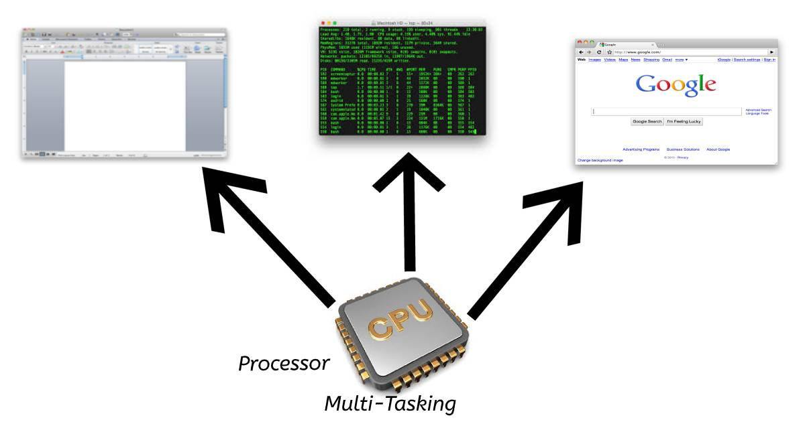
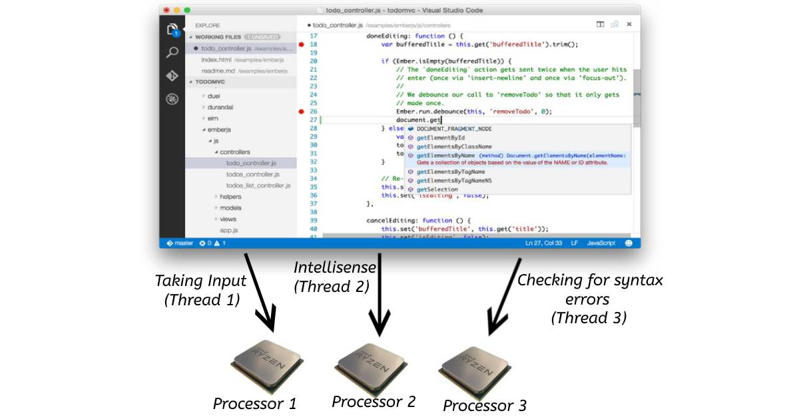

# Multi-Threading Vs Multi-Tasking (Async)

Before, I will tell you about the differences between multi-tasking and multi-threading, I will tell you about what is task and thread?

## Task

In computer, a task means a single application is running. For example, you started paint in windows.

## Thread

Every **task** is done by user  is divided into sub-tasks which are called threads.
For Example, when you run paint, then it has many threads such as paint, draw shapes, etc.

> A thread is a sequential flow of control in a program. 

Now, comes to multi-tasking and multi-threading.

## Multi-Tasking

When a user or multiple users runs more than one application at a time, then it is termed as multi-tasking. Whether you have single processor or multi-processors, multi-tasking is done on both.

Multi-tasking is done by quickly switching between tasks, so that user can use each program together. This makes the performance of user better.

Example : 

Like , you are using Ms Word, Ms Excel and Terminals at a time. This is the example of Multi-Tasking.

## Multi-Threading

When a user runs multiple sub-tasks of multiple-application, then this is called multi-threading. By using Multi-threading, we can increase the power of CPU by creating many threads in a process at a time. Multi-threading also provides the same resources and memory to processes as multi-tasking provides. While synchronous call runs on one thread, the other tasks of program which do not depend on that call run on different threads .In programming terms ,you can say it Asynchronous Programming.

Example: 

You are running Visual Studio Code Editor, When you start typing , IntelliSense starts working which helps you in code completion, showing syntax errors, indentation and many more. These are all threads which are running parallel in this application, on various processors. This will optimize your time and memory.

## Differences between Multi-Tasking and Multi-Threading

| Multi-Tasking                                                        	| Multi-Threading                                                                                            	|
|---------------------------------------------------------------------	|-------------------------------------------------------------------------------------------------------------	|
| 1- In Multi-tasking, one or more than one user can perform many tasks at a time. 	| In multi-threading, many threads or sub-threads of a single program or multiple programs are running parallel. 	|
| 2- Multitasking involves often CPU switching between the tasks.     	| Multi-threading involves switching of threads between processors.                         	|
| 3- In multitasking, each process take separate memory and resources.     	| In multithreading, processes are allocated same memory and resources because multi-threading is related to threads or sub-processes in single application.                                               	|